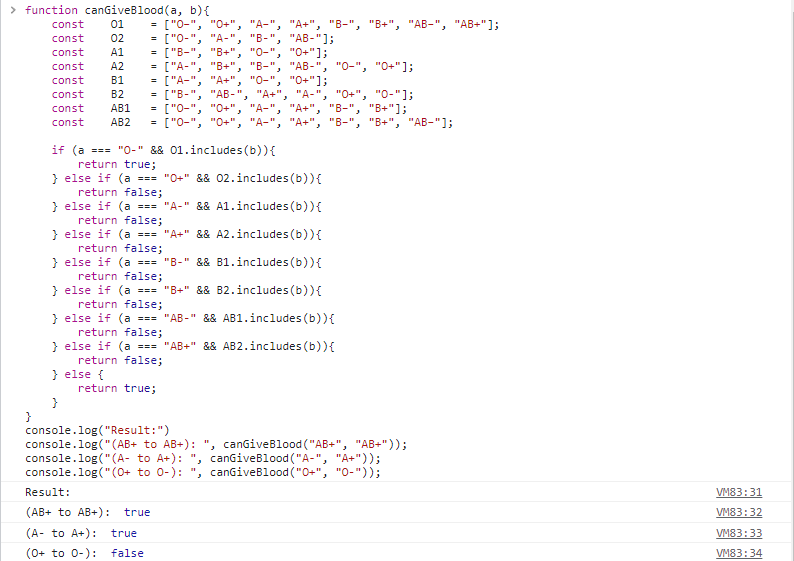

# Blood Type Java Script Practice
Made by:
Adyatama Mahabarata

Class:
L1BC

NIM:
2602158626

## Where to run
I run the code in google chrome, simply press F12 and go to console. After that put in your code.

It works as follows.
