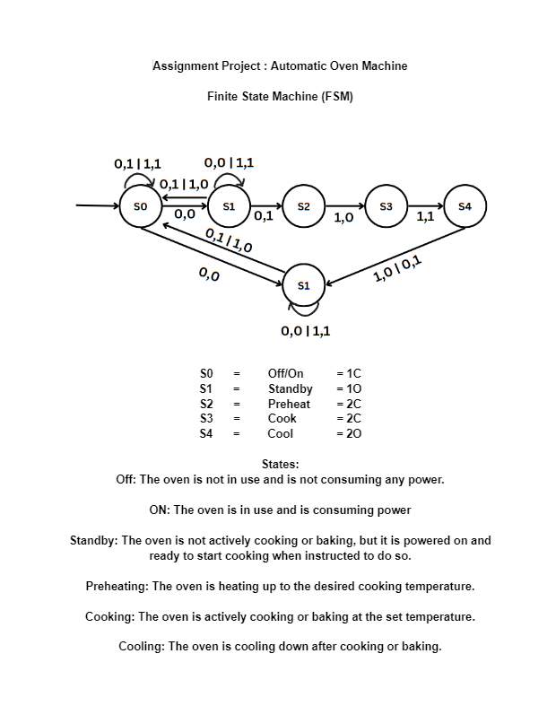
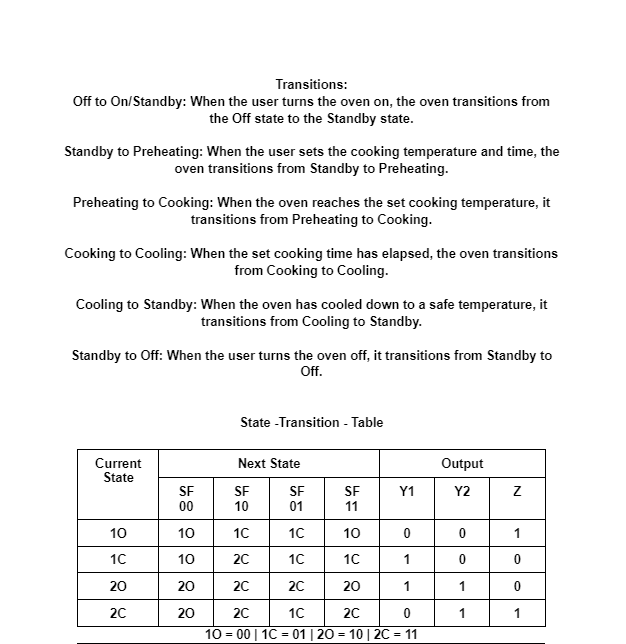
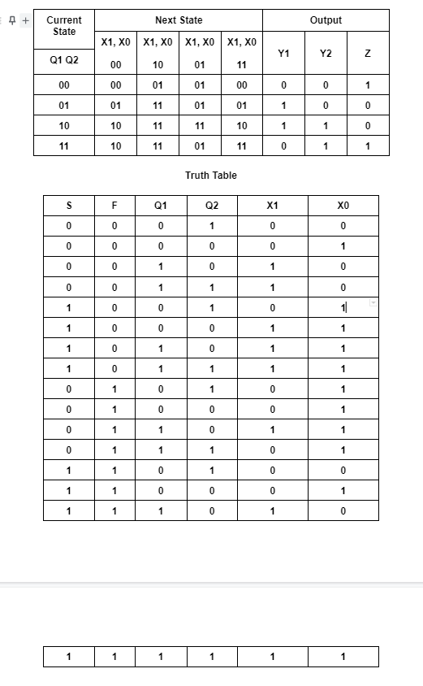
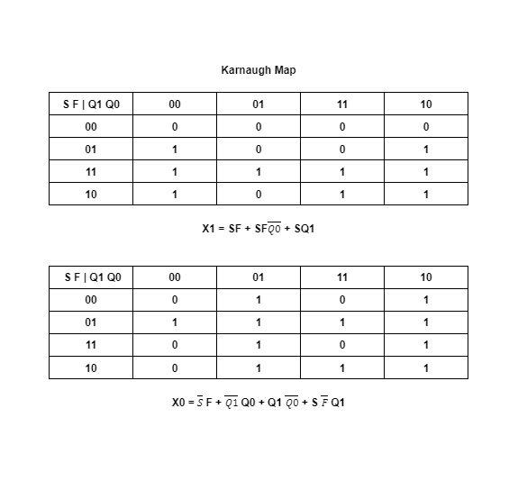
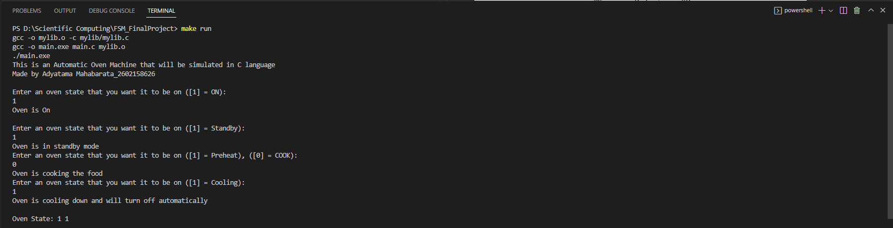
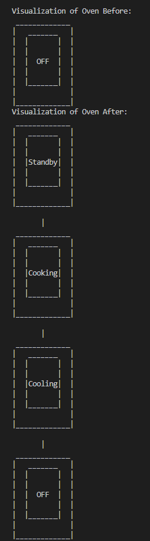

# Automatic Oven Machine FSM in C Language

This is an Automatic Oven Machine system using an Finite State Maching and it is made with C language.

# FSM drawing
 

# State Transition Table 
 

 ```
 S = On
 F = Standby mode
 Oven_1 = Oven State
 Oven_0 = Oven State

 ```

# Truth Table
 

# Karnaugh Map
 

 From the Karnaugh map we can derived both the X1 and X0 equations used in the implementation using C language:

```
[X1] = (User_S & User_F) | (User_S & User_F & (!Oven_0)) | (User_S & Oven_1);

[X0] = ((!User_S) & User_F) | ((!Oven_1) & Oven_0) | (Oven_1 & (!Oven_0)) | (User_S & (!User_F) & Oven_1);

S = On button
F = Standby mode
```

# How to run the code 
The steps on how to run to code is:
    1. Is to download all the files from the github link
    2. Open your terminal in your IDE
    3. In the terminal, type "make run".
    4. After running the files it will automatically show the automatic oven machine in C language

# Test Example

This is the test that i have done myself.



