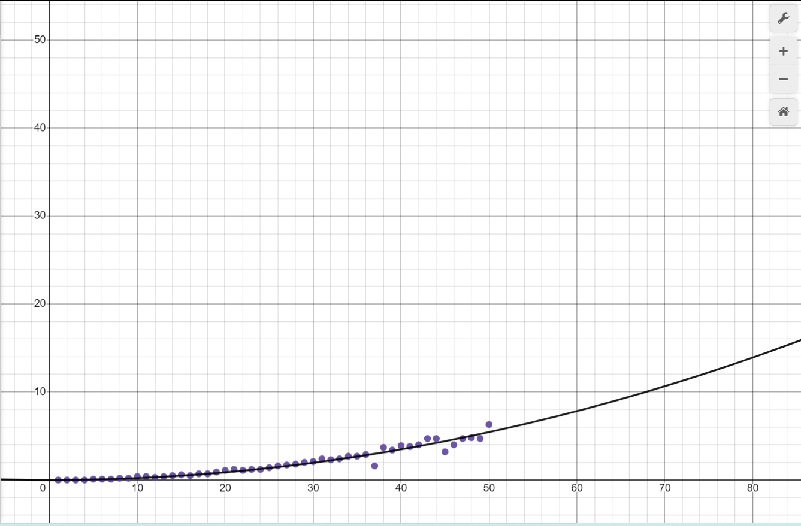
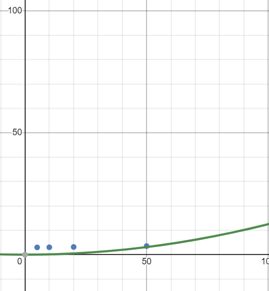

# Matrix-vector-mult-benchmark
Steps on how to run the matrix-vector-mult code and get benchmark results.

# Step 1 : make all the files needed to run the code

## make mylib/mylib.c and mylib/mylib.h

### mylib/mylib.c
implementations of functions

```c
#include <stdio.h>
#include <stdlib.h>


void printMat(int* M, int N){

    printf("[");
    for(int i=0; i<N; i++){
        printf("\n");
        for(int j=0; j<N; j++){
            printf("%d,\t",M[N*i+j]);
        }
    }
    printf("]\n");

}

void printVec(int* v, int N){
    printf("[");
    for(int i=0; i<N; i++){
        printf("\n");
        printf("%d,\t",v[i]);
    }
    printf("]\n");
}


void matVecMult(int* M, int* v, int* result, int N){

    for(int i=0; i<N; i++){
        result[i]=0;
        for(int j=0; j<N; j++){
            result[i] += M[N*i+j]*v[j];
        }
    }

}


#define LOWER 1
#define UPPER 9

int generateRandomInt(int lower, int upper){
    return (rand() % (upper-lower+1)) + lower;
}

void initMat(int* M, int N){
    for(int i=0; i<N; i++){
        for(int j=0; j<N; j++){
            M[N*i+j] = generateRandomInt(LOWER,UPPER);
        }
    }
}

void initVec(int* v, int N){
    for(int i=0; i<N; i++){
        v[i] = generateRandomInt(LOWER,UPPER);
    }
}
```

### mylib/mylib.h
declarations of functions

```c
void printMat(int* M, int N);
void printVec(int* v, int N);
int* matVecMult(int* M, int* v, int *result, int N);
int generateRandomInt(int lower, int upper);
void initMat(int* M, int N);
void initVec(int* v, int N);
```

## make the makefile
implementation of functions

```c
run:
	gcc -o mylib.o -c mylib/mylib.c
	gcc -o main.out main_test.c mylib.o
	./main.out

time:
	gcc -o mylib.o -c mylib/mylib.c
	gcc -o main_b_time.out main_b_time.c mylib.o
	./main_b_time.out

space:
	gcc -o mylib.o -c mylib/mylib.c
	gcc -o main_b_space.out main_b_space.c mylib.o
	./main_b_space.out

clear:
	rm *.out
	rm *.o
	rm *.dat
	rm *.exe
```
## make the main_test.c
Test implementation

```c
#include <stdio.h>
#include <stdlib.h>
#include "mylib/mylib.h"

int main()
{
    int MatSize = 3;

    int* x = (int*) malloc(MatSize * MatSize * sizeof(int));
    int* y = (int*) malloc(MatSize * sizeof(int));
    int* z = (int*) malloc(MatSize * sizeof(int));
    
    initMatRand(x, 0, 15, MatSize);
    initVecRand(y, 0, 15, MatSize);

    matVecMult(x, y, z, MatSize);

    printf("Matrix = ");
    printMat(x, MatSize);
    printf("Vector =");
    printVec(y, MatSize);
    printf("Matrix Vector = ");
    printVec(z, MatSize);

    free(x);
    free(y);
    free(z);

    return 0;
}
```
## make main_b_time.c
Implementation of time iterative

```c
#include <stdio.h>
#include <stdlib.h>
#include "mylib/mylib.h"
#include <time.h>

clock_t start, end;
double cpu_time_used;
double total_time_used;
int res;

FILE *fp, *fp2;


int main(){

    int N = 5000;

    int *matrix = (int *) malloc(N*N*sizeof(int));
    int *vector = (int *) malloc(N*sizeof(int));
    int *result = (int *) malloc(N*sizeof(int));
    
    fp = fopen("dataTimeNeeded.dat", "w");
    fp2 = fopen("dataTimeMax.dat", "w");

    for(N = 100; N <= 5000; N += 100){

        initMat(matrix, N); 
        initVec(vector, N);

        start = clock();
        matVecMult(matrix, vector, result, N);
        end = clock();

        cpu_time_used = ((double) (end - start)) / CLOCKS_PER_SEC;

        fprintf(fp, "(%d,%lf),", N, cpu_time_used);
        fprintf(fp2, "(%d,%lf),", N/100, cpu_time_used*100);

        printf("Runtime of current step: %lfs   N: %d\n", cpu_time_used, N);
    }

    fclose(fp);


    return 0;
}
```

## main_b_space.c
Implementation of space

```c
#include <stdio.h>
#include <stdlib.h>
#include "mylib/mylib.h"

int main(){

    int N;
    printf("Enter N:\n");
    scanf("%d", &N);

    int matrix[N*N];
    int vector[N];
    int result[N];

    initMat(matrix, N);
    initVec(vector, N);

    while(1){
        matVecMult(matrix, vector, result, N);
    }
    return 0;
}
```

# Step 2: Run the code and benchmark

## Run the main_test.c
Run the code by implementing this command to know if the code works.
```
make
```
## Run the main_b_time.c
in this code you will find the time complexity by running the code and benchmarking it. On the terminal enter the following code

```
make time

```

by doing this it will make two files that consist of actual runtime and magnified values of actual runtime that is named

```
dataTimeMax.dat
dataTimeNeeded.dat

```
where dataTimeNeeded.dat consist of actual runtime and dataTimeMax.dat consist of magnified values of actual runtime.

after running the code, copy all the values from dataTimeMax.dat and paste it in desmos.com.

It works as follows.


from the graph we can see the time complexity.

## Run the main_b_space.c
in this code you will find the space complexity by running the code and benchmarking it. On the terminal enter the following code.

```
make space
```

after running the space complexity code do it 3 more times with different values.

after running the code 4 times you can check your results in the task manager.
It works as follows.

.png)
.png)
.png)
.png)

afterwards we can use the result of the code by using the memory usage and divide them by 100 to make it simple to look at in the graph.

by doing this we get this graph:



from the graph we can see the space complexity.