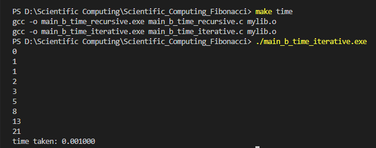
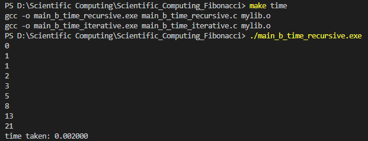
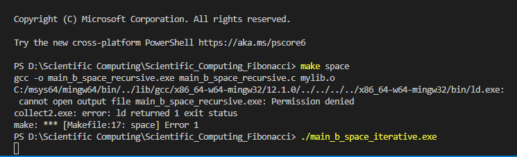
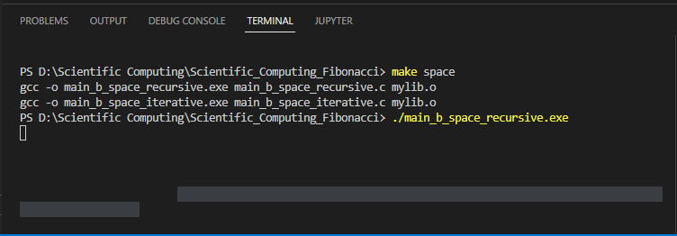

# main.c 
Test implementation

## Input
```c
#include <stdio.h>
#include "mylib/mylib.h"

int main(void){

	int N = 10;

	printf("%d! = %d = %d\n",N, fibonacciIterative(N), fibonacciRecursive(N));

	for(int i = 1; i <= N; i++){
		if (fibonacciIterative(i)!= fibonacciRecursive
		(i)){
			printf("[ERROR]\n");
		}
		else{
			printf("F(%d) = %d = %d\n",i,
			fibonacciIterative(i), fibonacciRecursive(i));
		}
	}

	return 0;
}
```

# mylib/mylib.c
Implementations of functions

```c
int fibonacciIterative(int N){
	int num1 = 0;
	int num2 = 1;
	int output;
	
	if (N==0){
		return num1;
	} else if (N==1){
		return num2;
	} else{
		for (int i = 2; i <= N; i++){
			output = num1+num2;
			num1 = num2;
			num2 = output;
		}
	

		}
		return output;
}

int fibonacciRecursive(int N){

	if (N == 0){
		return 0;
	} else if (N == 1){
		return 1;
	} else {
		return fibonacciRecursive(N-1) + fibonacciRecursive(N-2);
	}
}
```

# mylib/mylib.h
Declarations of functions

```c
int fibonacciIterative(int N);
int fibonacciRecursive(int N);
```

# main_b_time_iterative.c
Implementation of time iterative and benchmark

## Input
```c
#include <stdio.h>
#include <time.h>
#include "mylib/mylib.h"

int main()
{
	int n = 10;
	int c;
	int i = 0;
	clock_t t;
	t = clock();
	for (c = 2; c <= n; c++)
	{
		printf("%d\n", fibonacciIterative(i));
		i++;
	}
	t = clock()-t;
	double time_taken = ((double)t)/CLOCKS_PER_SEC;
	printf("time taken: %f", time_taken);
	return 0;
}
```
## Run
Time Iterative:
make time
./main_b_time_iterative.exe

## Output
it works as follows.


# main_b_time_recursive.c
Implementation of time recursive and benchmark

## Input
```c
#include <stdio.h>
#include <time.h>
#include "mylib/mylib.h"

int main()
{
	int n = 10;
	int c;
	int i = 0;
	clock_t t;
	t = clock();
	for (c = 2; c <= n; c++)
	{
		printf("%d\n", fibonacciRecursive(i));
		i++;
	}
	t = clock()-t;
	double time_taken = ((double)t)/CLOCKS_PER_SEC;
	printf("time taken: %f", time_taken);
	return 0;
}

```
## Run
Time Recursive:
make time
./main_b_time_recursive.exe

## Output
it works as follows.


# main_b_space_iterative.c
Implementation of space iterative and benchmark

## Input
```c
#include <stdio.h>
#include "mylib/mylib.h"

int main (void) {
	int a;
	while (1) {
		a = fibonacciIterative(1000);
	}
	return 0;
}
```

## Run
Space Iterative:
make space
./main_b_space_iterative.exe


## Output
It works as follows.


# main_b_space_recursive.c
Implementation of space Recursive and benchmark

## Input
```c
#include <stdio.h>
#include "mylib/mylib.h"

int main (void) {
	int a;
	while (1) {
		a = fibonacciRecursive(1000);
	}
	return 0;
}

```

## Run
Space Recursive:
make space
./main_b_space_Recursive.exe


## Output
It works as follows.
